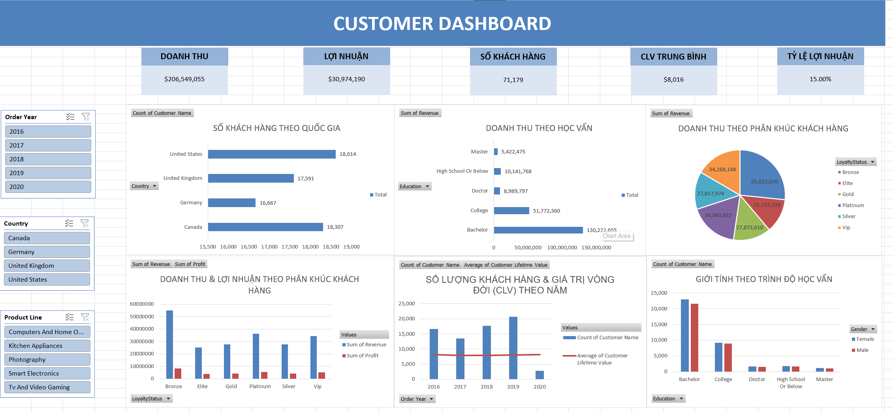
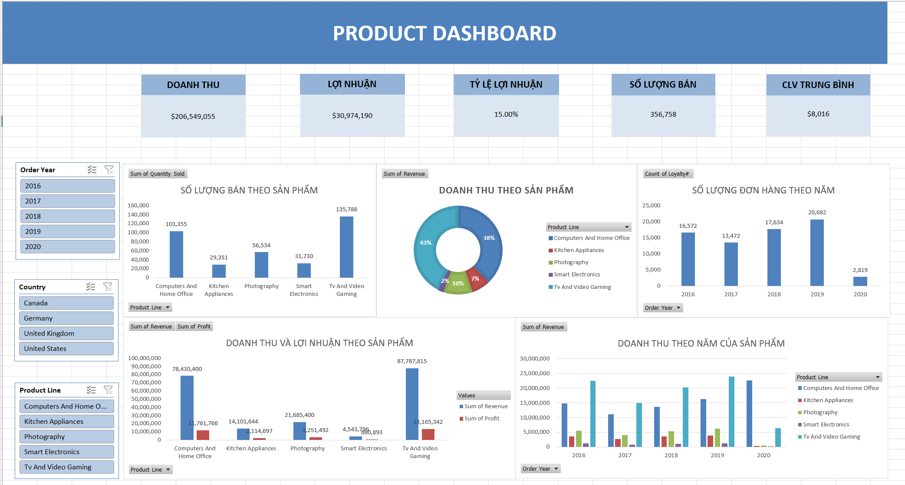

# Dự Án Phân Tích Hiệu Suất Kinh Doanh & Khách Hàng (2016 - 2020)

> Dự án tập trung vào việc xử lý dữ liệu giao dịch kinh doanh, xây dựng Dashboard phân tích khách hàng và sản phẩm nhằm hỗ trợ doanh nghiệp theo dõi hiệu suất kinh doanh và ra quyết định dựa trên dữ liệu. 


# Tổng Quan Dự Án

Dự án được xây dựng với mục tiêu:

* phân tích hành vi khách hàng
* đánh giá hiệu suất doanh thu và lợi nhuận
* theo dõi xu hướng bán hàng theo thời gian
* trực quan hóa dữ liệu bằng Excel Dashboard
* hỗ trợ doanh nghiệp đưa ra insight kinh doanh

Toàn bộ pipeline được triển khai theo flow thực tế của một DA (Data Analyst):

```text id="p4v7n1"
Raw Data
→ Data Cleaning
→ Feature Engineering
→ Pivot Analysis
→ Dashboard Visualization
→ Business Insight
```


# Công Nghệ & Công Cụ Sử Dụng

| Công nghệ    | Mục đích                  |
| ------------ | ------------------------- |
| Python       | Làm sạch và xử lý dữ liệu |
| Pandas       | Data Processing           |
| NumPy        | Feature Engineering       |
| Excel        | Pivot Table & Dashboard   |
| Excel Charts | Visualization             |
| GitHub       | Quản lý source code       |


# Thông Tin Dataset

Dataset bao gồm dữ liệu giao dịch trong giai đoạn:

```text id="t3z5v8"
2016 → 2020
```

Thông tin tổng quan:

* Tổng số khách hàng: `71,179`
* Tổng doanh thu: `$206.5M`
* Tổng lợi nhuận: `$31M`
* Tỷ suất lợi nhuận trung bình: `15%`
* Tổng số lượng bán: `356,758 sản phẩm`

Các trường dữ liệu chính:

* Product Line
* Revenue
* Profit
* Quantity Sold
* Country
* Education
* Loyalty Status
* Customer Lifetime Value (CLV)
* Order Year
* Gender


# Quy Trình Làm Sạch Dữ Liệu

Dữ liệu gốc được xử lý bằng Python tại file:

```text id="n8q1v4"
clean_db.py
```

Pipeline xử lý bao gồm:

* xử lý missing values
* chuẩn hóa định dạng dữ liệu
* convert datatype
* parse datetime
* phát hiện outliers
* feature engineering
* build analytical dataset

Các bước chính:

1. Xóa dữ liệu rỗng và trùng lặp
2. Chuẩn hóa dữ liệu text
3. Chuyển đổi kiểu dữ liệu số và ngày tháng
4. Tính toán Profit, Profit Margin
5. Tạo Year / Month phục vụ phân tích
6. Kiểm tra dữ liệu ngoại lai


# Dashboard Phân Tích

## 1. Customer Dashboard

Dashboard tập trung phân tích:

* số lượng khách hàng
* customer lifetime value
* doanh thu theo trình độ học vấn
* phân bố khách hàng theo quốc gia
* giới tính theo học vấn
* doanh thu theo loyalty status



### KPI Chính

* Tổng khách hàng: `71,179`
* Tổng doanh thu: `$206.5M`
* Tổng lợi nhuận: `$31M`
* CLV trung bình: `$8,016`
* Profit Margin: `15%`


## 2. Product Dashboard

Dashboard tập trung phân tích:

* doanh thu theo dòng sản phẩm
* lợi nhuận theo sản phẩm
* số lượng bán theo sản phẩm
* doanh thu theo năm
* hiệu suất sản phẩm theo thời gian



### KPI Chính

* Tổng doanh thu: `$206.5M`
* Tổng lợi nhuận: `$31M`
* Tổng số lượng bán: `356,758`
* CLV trung bình: `$8,016`
* Profit Margin: `15%`


# Business Insights

## 1. Insight Về Dòng Sản Phẩm

* `TV And Video Gaming` là dòng sản phẩm mang lại doanh thu và lợi nhuận cao nhất.
* `Computers And Home Office` đứng thứ hai và tăng trưởng mạnh trong giai đoạn làm việc từ xa.

Kết luận:

* đây là hai nhóm sản phẩm chiến lược cần được ưu tiên marketing và tồn kho.


## 2. Insight Về Khách Hàng

* Nhóm khách hàng trình độ `Bachelor` tạo ra doanh thu lớn nhất.
* Khách hàng hạng `Bronze` đóng góp phần lớn dòng tiền cho doanh nghiệp.

Kết luận:

* doanh nghiệp đang phụ thuộc nhiều vào nhóm khách hàng phổ thông thay vì nhóm cao cấp.


## 3. Insight Về Xu Hướng Thị Trường

* Giai đoạn `2016 → 2019` tăng trưởng ổn định.
* Năm `2020` giảm mạnh về số lượng đơn hàng nhưng CLV tăng cao.

Kết luận:

* mặc dù lượng khách giảm, doanh nghiệp vẫn giữ được nhóm khách hàng trung thành có giá trị cao.


# Đề Xuất Hành Động

## Về Sản Phẩm

* tối ưu chuỗi cung ứng cho nhóm TV & Gaming
* phát triển combo Work From Home
* đẩy mạnh cross-selling cho Smart Electronics

## Về Khách Hàng

* tập trung marketing vào thị trường Bắc Mỹ
* xây dựng chương trình loyalty cho nhóm Bronze
* tăng retention cho nhóm khách hàng CLV cao


# Cấu Trúc Thư Mục

```text id="m7x2v5"
CUSTOMER_SALES/
│
├── db/
│   └── DB.xlsx
│
├── img/
│   ├── customer_dashboard.png
│   └── product_dashboard.png
│
├── clean_db.py
├── Cleaned_data.xlsx
└── README.md
```


# Hướng Dẫn Chạy Project

## 1. Chạy Pipeline Làm Sạch Dữ Liệu

```bash id="q4x9m2"
python clean_db.py
```

Output:

```text id="z5t1w8"
Cleaned_data.xlsx
```


## 2. Tạo Pivot Table

Trong Excel:

* import cleaned dataset
* build Pivot Table
* tạo KPI summary
* tạo aggregation layer


## 3. Xây Dựng Dashboard

Sử dụng:

* Pivot Chart
* Slicer
* KPI Card
* Excel Visualization

để xây dựng:

* Customer Dashboard
* Product Dashboard


# Output Chính

| File                   | Mục đích             |
| ---------------------- | -------------------- |
| DB.xlsx                | dữ liệu gốc          |
| Cleaned_data.xlsx      | dữ liệu đã clean     |
| customer_dashboard.png | dashboard khách hàng |
| product_dashboard.png  | dashboard sản phẩm   |


# Giá Trị Mang Lại

Hệ thống hỗ trợ:

* phân tích hành vi khách hàng
* theo dõi hiệu suất kinh doanh
* hỗ trợ business reporting
* trực quan hóa dữ liệu
* hỗ trợ doanh nghiệp ra quyết định dựa trên dữ liệu


# Kết Luận

Dự án giúp chuyển đổi dữ liệu giao dịch thô thành hệ thống Dashboard trực quan phục vụ phân tích kinh doanh. Thông qua việc phân tích hiệu suất sản phẩm và hành vi khách hàng, doanh nghiệp có thể xác định các nhóm sản phẩm chiến lược, tối ưu nguồn lực marketing và nâng cao giá trị khách hàng dài hạn. 
